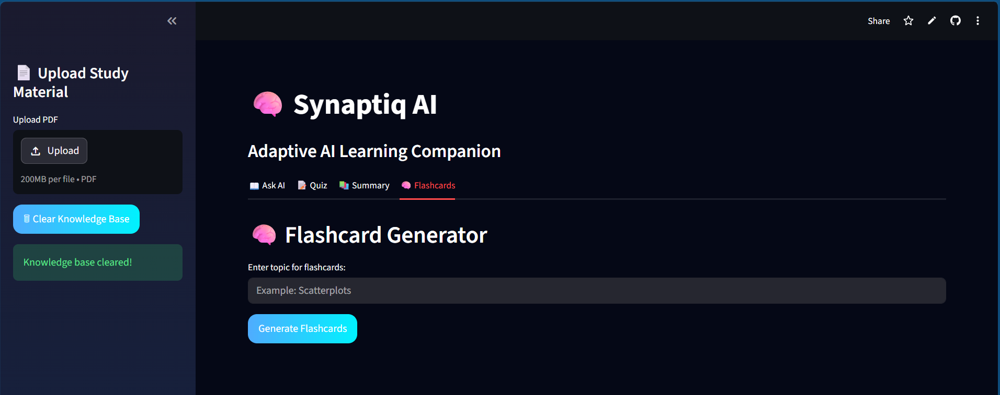
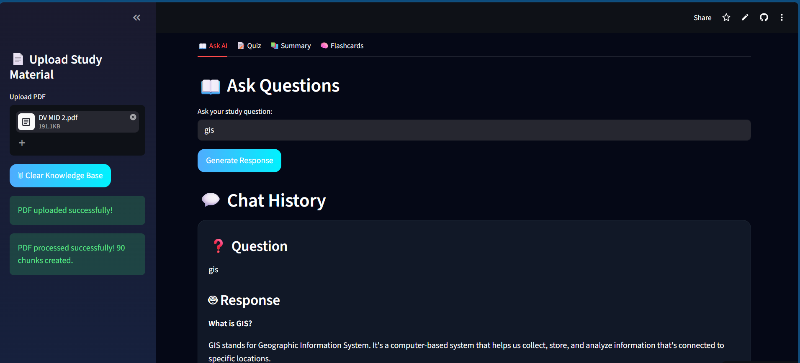
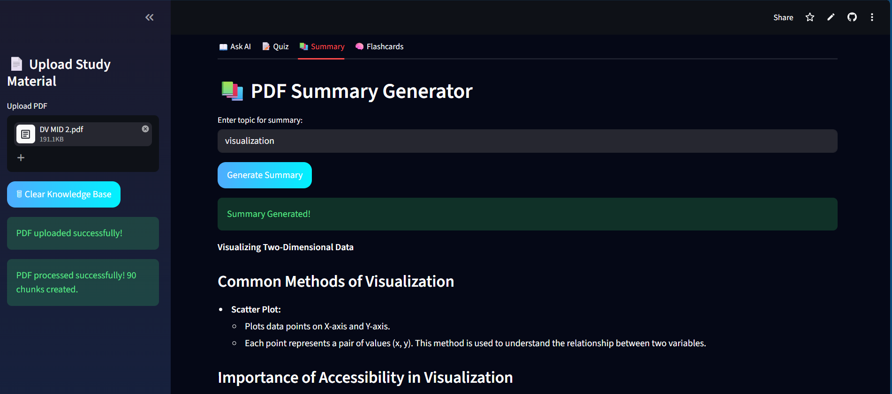

# 🧠 Synaptiq AI

Synaptiq AI is an AI-powered adaptive learning companion built using Retrieval-Augmented Generation (RAG), NLP, and Generative AI techniques.

The system allows users to upload study PDFs and interact with them intelligently through AI-powered question answering, quiz generation, flashcards, and summaries.

---

# 🚀 Features

- 📄 PDF Upload & Processing
- 🤖 AI-powered Question Answering
- 🧠 Retrieval-Augmented Generation (RAG)
- 🔍 Semantic Search using FAISS
- 📝 Interactive Quiz Generator
- 📚 AI Flashcard Generator
- 📖 Smart Study Summaries
- 💬 Chat History Support
- ☁️ Streamlit Cloud Deployment

---

# 🛠️ Tech Stack

## Frontend
- Streamlit

## Backend
- Python

## AI / NLP / GenAI
- Groq API
- Llama 3
- Sentence Transformers
- LangChain
- FAISS Vector Database
- RAG Pipeline

## Libraries
- Transformers
- PyPDF
- Pandas
- NumPy
- Matplotlib

---

# 🧩 System Architecture

```text
PDF Upload
   ↓
Text Extraction
   ↓
Chunking
   ↓
Sentence Embeddings
   ↓
FAISS Vector Store
   ↓
Semantic Retrieval
   ↓
LLM Response Generation
   ↓
Quiz / Flashcards / Summary
```

---

# ⚙️ Installation

## Clone Repository

```bash
git clone https://github.com/ManishaGurugubelli/Synaptiq-AI.git
```

## Install Dependencies

```bash
pip install -r requirements.txt
```

## Run Application

```bash
streamlit run app.py
```

---

# 🖥️ Application UI

### 📌 Main Interface


### 🤖 Ask AI Feature


### 📖 Summary Generator


---

# 🌐 Live Demo

Streamlit Deployment:  
https://synaptiq-ai-ccwyy5spbudwvbgdafxiax.streamlit.app/

---

# 👩‍💻 Author

Manisha Gurugubelli
